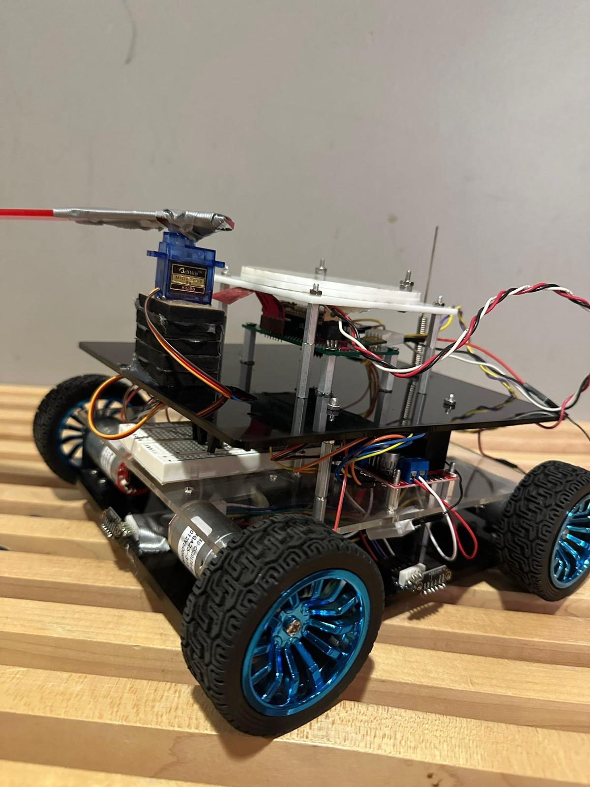
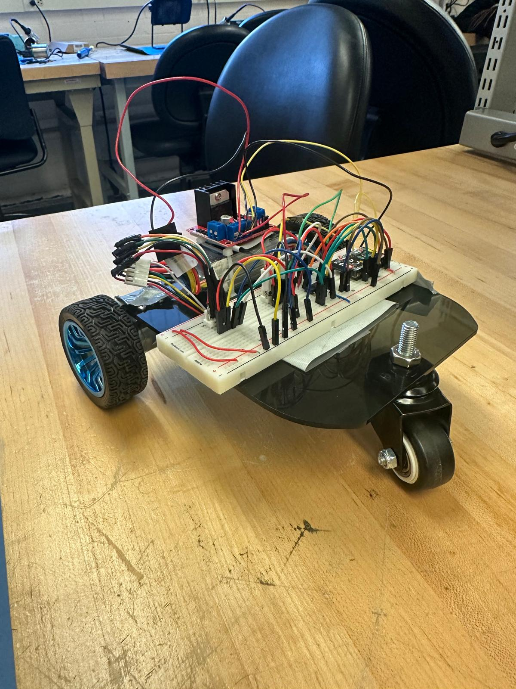
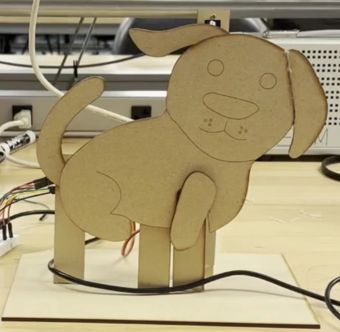

# Autonomous Mobile Robot

> Building intelligent robotic systems from the ground up - from basic microcontroller programming to fully autonomous navigation.


*Four-wheeled autonomous robot with Vive positioning, obstacle avoidance, and web-based control.*

---

## 🎯 Overview

This repository documents the complete development journey of building an autonomous mobile robot system, progressing from fundamental embedded systems concepts to a sophisticated robot capable of autonomous navigation and obstacle avoidance.

**Key Achievements:**
- ✅ Differential drive robot with closed-loop motor control
- ✅ Real-time positioning using HTC Vive tracking system
- ✅ Multi-sensor obstacle detection (ToF sensors)
- ✅ WiFi-enabled web interface for remote control
- ✅ Autonomous path planning and navigation

---

## 📂 Repository Structure

```
autonomous-mobile-robot/
├── labs/                    # Progressive lab exercises
│   ├── lab0/               # Introduction to embedded systems
│   ├── lab1/               # PWM, timers, and LED control
│   ├── lab2/               # Digital I/O and frequency detection
│   ├── lab3/               # ADC and servo control
│   └── lab4/               # ESP32, wireless communication, motor control
│       ├── part1/          # WiFi basics and web servers
│       └── part2/          # Differential drive robot
├── final-project/          # Autonomous navigation system
│   ├── code/               # Main robot controller and positioning
│   ├── presentations/      # Design reviews and demos
│   └── report.pdf         # Final project documentation
└── results/                # Videos and images of working systems
    ├── lab3/              # Servo-controlled puppet (Waldo)
    ├── lab4/              # Basic three-wheeled robot
    └── final-project/     # Autonomous four-wheeled robot
```

---

## 🚀 Project Showcase

### Final Project: Autonomous Navigation Robot

A four-wheeled mecanum drive robot with integrated positioning, obstacle detection, and autonomous navigation capabilities.

<table>
<tr>
<td width="50%">

**Hardware:**
- ESP32-S3 microcontroller
- Vive positioning system
- 3x VL53L0X ToF sensors
- Dual motor drivers with encoders
- Custom mecanum wheel chassis

</td>
<td width="50%">

**Capabilities:**
- Sub-centimeter positioning accuracy
- Real-time obstacle avoidance
- PD motor control loops
- Web-based manual control
- Autonomous waypoint navigation

</td>
</tr>
</table>

#### System Images

<table>
<tr>
<td></td>
<td></td>
</tr>
</table>

#### Demonstration


*Robot autonomously navigating to target coordinates using Vive positioning while avoiding obstacles.*

---

### Lab 4: Differential Drive Robot

Three-wheeled differential drive robot with ESP32 control and web interface.

<table>
<tr>
<td width="60%">



</td>
<td width="40%">

**Features:**
- WiFi Access Point mode
- Real-time web control
- Encoder feedback
- PD velocity control
- Directional control system

</td>
</tr>
</table>

#### Web Control Demo


*Real-time robot control via custom web interface with responsive direction commands.*

---

### Lab 3: Servo Control System

Multi-axis servo control using potentiometers and ADC, demonstrated through an animatronic puppet.

<table>
<tr>
<td width="40%">



</td>
<td width="60%">

**Implementation:**
- 3-channel ADC reading
- Servo position mapping
- Real-time angle calculation
- Smooth motion control

**Application:**
Control of paw, tail, and ear servos synchronized with potentiometer inputs.

</td>
</tr>
</table>

#### Servo Control Demo


*Precise servo control responding to potentiometer inputs in real-time.*

---

## 🛠️ Technology Stack

### Hardware
- **Microcontrollers:** ATmega32U4, ESP32-S3
- **Sensors:** VL53L0X ToF sensors, rotary encoders, potentiometers
- **Actuators:** DC motors with encoders, servo motors
- **Communication:** WiFi (ESP32), USB serial
- **Positioning:** HTC Vive lighthouse system

### Software & Tools
- **Languages:** C/C++, Arduino
- **Protocols:** I2C, WiFi (UDP/HTTP), PWM
- **Control Systems:** PD control loops, differential drive kinematics
- **Web Technologies:** HTML/CSS/JavaScript for control interface
- **Development:** Arduino IDE, AVR toolchain

### Key Algorithms
- Median filtering for sensor noise reduction
- PD control for motor speed regulation
- Differential drive kinematics
- Coordinate transformation for positioning
- Obstacle avoidance logic

---

## 📊 Technical Highlights

**Motor Control Performance:**
- Velocity tracking accuracy: ±5 RPM
- Response time: <100ms
- Sample rate: 10Hz (100ms intervals)

**Positioning System:**
- Update rate: ~30Hz
- Positioning accuracy: <1cm
- Coverage area: 4m x 4m workspace

**Obstacle Detection:**
- Sensor range: 30-1200mm
- Detection accuracy: ±3% at 200mm
- Response time: <50ms

---

## 📖 Learning Progression

This project demonstrates proficiency in:

1. **Embedded Systems** - Register-level programming, interrupts, timers
2. **Sensor Integration** - ADC, digital I/O, frequency measurement
3. **Motor Control** - PWM, H-bridges, closed-loop control
4. **Wireless Systems** - WiFi configuration, web servers, UDP communication
5. **Robotics** - Kinematics, localization, path planning
6. **System Integration** - Multi-sensor fusion, real-time control

---

## 🎓 About

This project was developed as part of a comprehensive robotics course, progressing from fundamental embedded systems concepts to advanced autonomous navigation. Each lab builds upon previous skills, culminating in a fully functional autonomous mobile robot.

**Project Timeline:** Fall 2024  
**Institution:** University of Pennsylvania 
**Course:** MEAM 5100 - Design of Mechatronic Systems

---

## 📧 Contact

**Saayuj Deshpande**  
[Your Email] | [LinkedIn] | [Website]

---

*Built with precision, passion, and a lot of debugging.*
